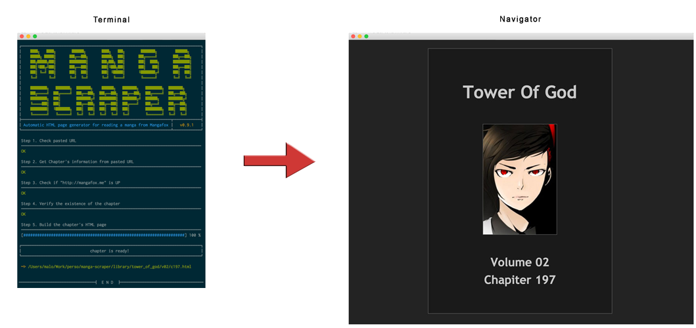

# Manga Scraper

## Why?
> “I don't want to waste my time while scans are loading, just as I don't need to see adds aside to the content I came to read.“ - Malo Blanchard

## How it works?


## Usage
```bash
git clone https://github.com/Izin/manga-scraper.git
cd manga-scraper
bash scrap "{MANGAFOX_URL}"

# Example for a single chapter
bash scrap "http://mangafox.me/manga/tower_of_god/v02/c197/1.html"

# Example for an entiere volume
bash scrap "http://mangafox.me/manga/tower_of_god/v02"
```

## Philosophy
 - clear reading of the manga
 - nothing invading the space
 - quick transition between scans
 - easy switch between scans using directional keys

## Dependencies
  - curl
  - awk

## Donate
I maintain this project in my free time, you can support my work via [Paypal](paypal.me/maloblanchard). Thanks!


